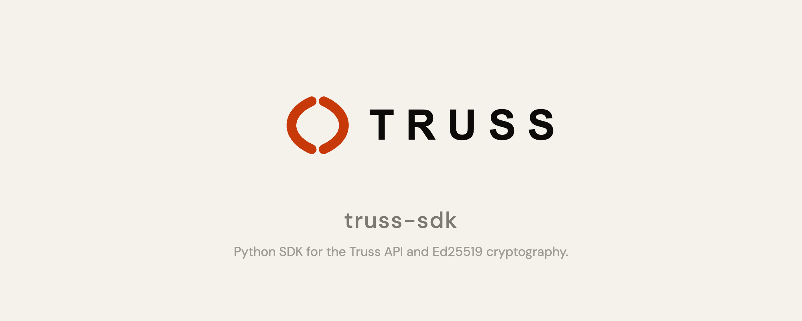

# Truss SDK — Python

**Python SDK for the Truss trust infrastructure API — create mandates, record actions, manage agents, and verify evidence.**

[](https://pypi.org/project/truss-sdk/)
[](https://pypi.org/project/truss-sdk/)
[](LICENSE)
[](https://github.com/tensflare/truss-sdk-python/actions)

---

## What is Truss?

Truss is an **accountability layer for AI agents** — it records every agent action as a cryptographically signed, tamper-evident audit trail. [Learn more →](https://truss.tensflare.com/docs)

## Features

- **Ed25519 cryptography** — Key generation, payload signing, and signature verification via `PyNaCl`
- **`TrussClient`** — Full-featured HTTP client for the Truss API
- **`ActionContext`** — Builder pattern for recording actions with chain-of-custody linkage
- **Dataclass models** — Mirroring Truss TAP schemas with full type annotations
- **Python ≥3.9**

## Installation

```bash
pip install truss-sdk
```

## Quick start

```python
from truss_sdk import TrussClient, generate_keypair, sign_payload, verify_signature

# 1. Generate an Ed25519 keypair
kp = generate_keypair()
print(f"Public key:  {kp.public_key}")
print(f"Private key: {kp.private_key}")  # keep secret!

# 2. Sign and verify
sig = sign_payload({"action": "read", "value": 42}, kp.private_key)
assert verify_signature({"action": "read", "value": 42}, sig, kp.public_key)
print("Signature valid: True")

# 3. Create an API client
client = TrussClient(api_key="tr_your_api_key")

# 4. Register an agent
agent = client.create_agent(
    name="My Agent",
    public_key=kp.public_key,
    description="My autonomous agent",
)

# 5. Create a mandate
mandate = client.create_mandate(
    mandate_id="mnd_001",
    agent_id=agent.id,
    agent_name=agent.name,
    issuing_principal={
        "entity": "org_1",
        "human_id": "usr_1",
        "role": "Admin",
    },
    scope={"permitted_actions": ["read", "write"]},
    jurisdiction_context={
        "deploying_org_jurisdiction": "US",
        "operating_jurisdictions": ["US"],
    },
    validity={
        "issued_at": "2026-06-06T00:00:00Z",
        "expires_at": "2026-12-31T23:59:59Z",
    },
    private_key=kp.private_key,
)

# 6. Record an action using the builder pattern
ctx = client.action("read", mandate.id, kp.private_key)
ctx.record_input({"file": "/data/report.pdf"})
ctx.record_output({"summary": "Report contains 42 records"})
result = ctx.commit(agent_id=agent.id, chain_position=1, prev_record_hash=None)
print(f"Action recorded: {result.id}")
```

## API reference

### `generate_keypair()`

Returns a `Keypair` namedtuple with `.public_key` and `.private_key` fields.

### `sign_payload(payload, private_key)`

Signs any JSON-serialisable `dict` and returns a hex-encoded Ed25519 signature string.

### `verify_signature(payload, signature, public_key)`

Verifies an Ed25519 signature. Returns `bool`.

### `TrussClient(api_key, api_url=None)`

| Parameter | Type | Description |
|---|---|---|
| `api_key` | `str` | Truss API key (`tr_` prefix) |
| `api_url` | `str` | API base URL (default `http://localhost:4000`) |

**Client methods:** `create_agent`, `get_agent`, `list_agents`, `create_mandate`, `get_mandate`, `list_mandates`, `record_action`, `get_action`, `list_actions`, `create_delegation`, `generate_evidence`, `verify_evidence`, and more.

### `client.action(action_type, mandate_id, private_key)`

Returns an `ActionContext` builder with `.record_input()`, `.record_output()`, `.commit()`.

## Related packages

| Package | Description |
|---|---|
| [@tensflare/tap](https://github.com/tensflare/truss-tap) | Core Zod schemas for mandates, actions, and delegations |
| [@tensflare/truss-sdk](https://github.com/tensflare/truss-sdk-js) | TypeScript SDK equivalent |
| [@tensflare/cli](https://github.com/tensflare/truss-cli) | Command-line interface |

## Development

```bash
pip install -e ".[dev]"
pytest
```

## Contributing

Pull requests are welcome. Please see the [contribution guidelines](https://truss.tensflare.com/docs/contributing).

## License

Apache 2.0 — see [LICENSE](LICENSE).
